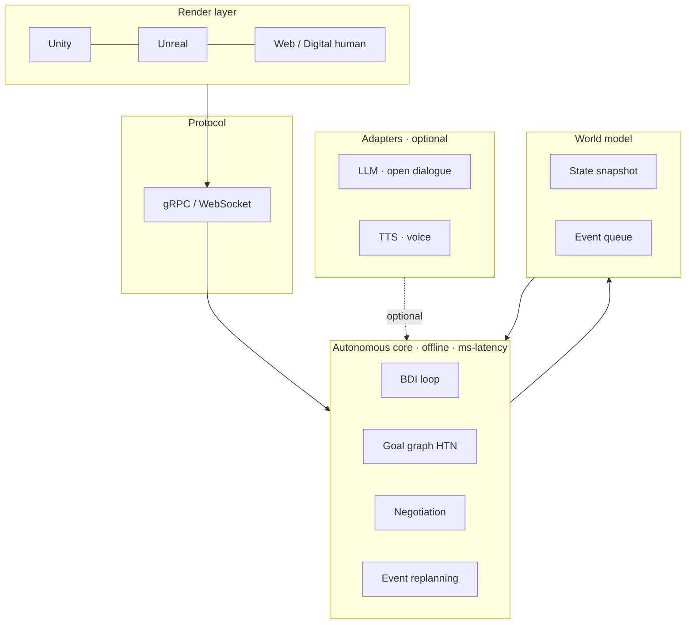

# Native AI Lifeforms

> From scripted NPCs to digital companions that **negotiate, work, and replan on their own**.

[](LICENSE)


[简体中文](README.md) | English

---

This repository distills lessons from two shipped Windows prototypes:

| Prototype | Engine | What it demonstrates |
|---|---|---|
| **Monta · NPC Autonomous Camp** | Unity | Two companions pick a site, negotiate a division of labor by voice, gather resources, capture a pet, and build a shelter. Inject "teammate injured" or "resource node blocked" and they replan on the fly. |
| **QY · Third-Person Open Scene** | Unreal Engine 5 | A high-fidelity third-person shell that hosts the same autonomous agents. |

Both prototypes show that, **offline, without an LLM, without network access, and without API keys**, two NPCs can close the loop of *goal → negotiate → execute → replan on disturbance → deliverable* in about two minutes. That is the minimum viable form of a "Native AI Lifeform".

> ⚠️ We adopt the original prototype authors' stance: **this is not consciousness.** It is an engineering system that produces life-like *behavior*.

---

## Why another NPC framework?

| Type | How it's driven | Problem |
|---|---|---|
| Scripted NPC | FSM / behavior tree | Dead outside the designer's corridor |
| Motion puppet | Pre-baked animation | Can't decide what to do |
| LLM agent | LLM on every tick | 1–5 s latency, high cost, hallucinated goals, hard to audit |
| **Native AI Lifeform (this)** | BDI + goal graph + negotiation + replanning, LLM as a plug-in | Deterministic, offline, auditable, milliseconds |

## Architecture



## Quick start

```bash
git clone https://github.com/leslie520-bye/native-ai-lifeforms.git
cd native-ai-lifeforms
pip install -e .
python -m native_life
# or, with perturbations injected:
python -m examples.camp_demo --events injury,block
```

Watch `Aki` and `Ren`:
1. split up who gathers wood / stone / captures the pet;
2. work in parallel;
3. after the `injury` event, the hurt agent retreats to recover, the other picks up the half-finished wall;
4. after the `resource blocked` event, the gatherer abandons the node and retargets.

The CLI demo runs the **same state machine** as the Unity build, just rendered to stdout.

## Repository layout

```
native-ai-lifeforms/
├── README.md / README.en.md
├── docs/
│   ├── solution.md       # industry playbook (中文)
│   ├── solution.en.md    # industry playbook (English summary)
│   └── paper.md          # academic paper (English)
├── src/native_life/
│   ├── world.py          # deterministic world + event queue
│   ├── task_graph.py     # STRIPS/HTN goal graph
│   ├── agent.py          # BDI loop + shared plan board
│   ├── negotiation.py    # bounded proposal/counter-proposal
│   ├── replanner.py      # event-driven replanning
│   ├── skills.py         # atomic actions
│   └── llm_adapter.py    # optional LLM hook (default: stub)
├── examples/camp_demo.py
└── tests/test_planning.py
```

> The closed Unity / Unreal binaries contain licensed art and are **not** redistributed here. This repo is the readable, modifiable equivalent.

## Docs

- 📘 **Industry playbook**: [`docs/solution.md`](docs/solution.md) (中文) · [`docs/solution.en.md`](docs/solution.en.md) (EN summary)
- 📄 **Paper**: [`docs/paper.md`](docs/paper.md)

## Roadmap

- [x] v0.1 — core kernel + playbook + paper
- [ ] v0.2 — gRPC bridge to Unity / UE5
- [ ] v0.3 — real LLM adapter with safety filter
- [ ] v0.4 — scale to 16 concurrent agents + visual inspector

## Design principles

1. **Deterministic first, probabilistic second.**
2. **Auditable > clever.** Every NPC can tell you, at any tick, what it's doing and why.
3. **Not consciousness.** We build life-like *behavior*, not minds.
4. **Engine-neutral.** Python brain, any body.

## License & citation

MIT © native-ai-lifeforms contributors. See [`CITATION.cff`](CITATION.cff).
